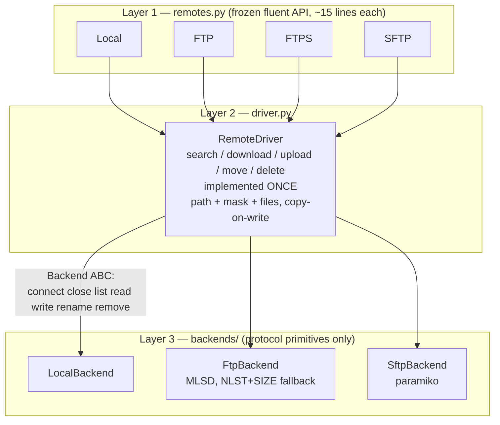

# multiremote-fm refactor — design spec

**Date:** 2026-08-28
**Status:** Approved 2026-08-28 — not yet implemented
**Scope:** Structural refactor of the uncommitted working tree into a real, installable package. Public API frozen.

---

## 1. Purpose

`multiremote-fm` exists to operate on files across heterogeneous remotes (local directory, FTP, FTPS, SFTP) through one interface. It shipped once — PyPI `0.1`, Jul 2023 — as a single 657-line `multiremote_fm.py`.

The working tree contains an **uncommitted, unfinished** split of that module into root-level `core/` + `drivers/` + `remote.py`. It has never imported successfully. This spec defines the design that finishes the split correctly: one installable package, the five file operations implemented **once** instead of three times, and every verified defect closed — while the public surface documented in `README.md` stays byte-for-byte compatible.

The refactor is not motivated by aesthetics. It is motivated by a single measurable fact established in §2.2: the five operations are copy-pasted across three drivers, the copies have diverged, and every defect in §2.1 is a symptom of that divergence.

---

## 2. Current state

### 2.1 Verified defect table

All confirmed by execution against the working tree. Nothing here is speculative.

| # | Defect | Evidence |
|---|--------|----------|
| 1 | **Package does not import at all.** `drivers/__init__.py` is 100% commented out (all 10 lines), so the re-exports do not exist. | `__init__.py:4` → `ImportError: cannot import name 'FTP'` |
| 2 | **Not installable.** `__init__.py` sits at repo *root*; modules use absolute imports (`from core.base import ...` at `remote.py:4`, `from remote import RemoteDriver` at `drivers/local.py:5`); no `multiremote_fm/` package directory exists; `pyproject.toml` has no `[tool.setuptools]` packages config. The tree cannot produce a valid wheel. | `pyproject.toml` (23 lines, no packages table) |
| 3 | **`paramiko` used but undeclared.** No runtime dep, no optional extra, no dev extra in `pyproject.toml`. | `drivers/sftp.py:9`; `pyproject.toml` has no `dependencies` key |
| 4 | **The paramiko import guard guarantees the crash it was meant to prevent.** `try: import paramiko / except ImportError: paramiko = None` (`drivers/sftp.py:8-11`), but the class body annotates `Optional[paramiko.Transport]`, evaluated at class-definition time. | `drivers/sftp.py:33` → `AttributeError: 'NoneType' object has no attribute 'Transport'` |
| 5 | **`Local.search()` with no mask returns ZERO files.** Default mask is `''` (`remote.py:16`), so `os.path.join(path, '')` globs the directory itself; the `isfile` assert then skips it. Proven: 3 real files in a dir → `search()` == 0, `with_mask('*')` == 3. | `drivers/local.py:19`, `drivers/local.py:25` |
| 6 | **`RemoteFileSet` cannot deduplicate.** `RemoteFile` defines neither `__eq__` nor `__hash__`, so the backing `set` identity-hashes. Proven: two identical `RemoteFile('same.txt', b'x', 1)` → `len(RemoteFileSet(a, b)) == 2`. | `core/file.py:8-39` (no dunders), `core/file.py:70` |
| 7 | **`assert` used for control flow at 13 sites.** Under `python -O` these vanish: `upload()` on an empty fileset goes from `AssertionError` to **silent success**. | `drivers/ftp.py:99,102,109,112,121,124`; `drivers/local.py:25,48,50,57,59,67,69` |
| 8 | **Blanket `setattr` swallows typos.** `RemoteDriver.__init__` loops `**kwargs` and `setattr`s each key, so `FTP(..., pasword='x')` is silently accepted and `self.password` stays unset. | `remote.py:18-20` |
| 9 | **ABC enforces no contract.** Every abstract method is declared `*args, **kwargs`. | `core/base.py:12,17,22,27,37,41,52` |
| 10 | **FTP driver dead/broken code.** `_ensure_connection` is defined but never called (`download`/`upload`/`move`/`delete` each call `self.connect()` directly); `_ftp` is never assigned, so `disconnect()` is a permanent no-op; `encoding` is accepted and never used; `FTPS` duplicates the entire constructor signature. | `drivers/ftp.py:66-70` (dead), `drivers/ftp.py:58-64` (no-op), `drivers/ftp.py:23,39` (encoding), `drivers/ftp.py:131-133` (FTPS) |
| 11 | **Dead exceptions.** `InvalidResponseCodeError` and `InvalidJSONResponseError` — leftovers from a deleted HTTP driver, re-exported but unused by any driver. | `core/exceptions.py:31-44`, `core/__init__.py:9-10` |
| 12 | **`requires-python = ">=3.9"` is false.** `core/file.py:25` is `def mimetype(self) -> str \| None:` — PEP 604 evaluated at def time, unimportable on 3.9. Sole offender in the tree. | `pyproject.toml:13` vs `core/file.py:25` |
| 13 | **Tests.** `tests/test_sftp.py` has 3 real failures: `test_import_without_paramiko` (`sftp.py:30`), `test_connect_with_password` and `test_connect_with_rsa` — the latter two assert that `timeout=30` is passed to `Transport.connect` (`tests/test_sftp.py:83,110`), but that parameter does not exist, which is why the call site is commented out (`drivers/sftp.py:88`); `response_timeout` is therefore silently ignored on every SFTP connection. `test_local_dir` reports 5/5 pass, but `test_search_common` passes **vacuously on zero files** (defect 5): it only iterates and asserts nothing about count. | `tests/test_local_dir.py:40-47`; `paramiko/transport.py:1268` |
| 14 | **CI.** Only `.github/workflows/publish-to-pypi.yml` exists (publish on tag). Uses deprecated `::set-output` (`:27`) and `actions/checkout@main` (`:13`). No test or lint job anywhere. | `.github/workflows/publish-to-pypi.yml` |

### 2.2 Root cause: the five operations are copy-pasted three times

`search` / `download` / `upload` / `move` / `delete` are reimplemented per driver:

| Driver | Lines |
|--------|-------|
| `drivers/local.py` | 72 |
| `drivers/ftp.py` | 133 |
| `drivers/sftp.py` | 286 |
| **total** | **~491** |

Every copy re-implements the same five-step shape: resolve path+mask → list directory → match mask → per-file transfer → wrap in `RemoteFile`. The copies have **diverged**, which is precisely why the defects above are per-driver rather than global:

- **Three different mask semantics.** `Local` joins path+mask and hands the result to `glob.glob` (`local.py:19-20`). `FTP` joins path+mask and hands the result to `NLST` (`ftp.py:80,83`). `SFTP` ignores the join entirely and `fnmatch`es a `listdir_attr` result (`sftp.py:133,143`).
- **Defect 5 is driver-local.** `Local` breaks on the empty default mask; `SFTP` does not, because it alone defaults `self.mask or '*'` (`sftp.py:143`).
- **Defect 10 is driver-local.** `SFTP` wires up `_ensure_connection` (`sftp.py:113-117`, called at `:130,:181,:207,:239`); `FTP` has the byte-identical method sitting dead (`ftp.py:66-70`).
- **Defect 7 is driver-local.** `Local` and `FTP` guard with `assert`; `SFTP` guards with `if not self.files: return self` and `isinstance` checks that log-and-continue.

There is no protocol-specific logic in any of the five operations. The only protocol-specific work is seven primitives: connect, close, list, read, write, rename, remove.

---

## 3. Constraints

### 3.1 The public API is frozen

The user's decision: **preserve the existing public surface exactly as documented in `README.md`.** Every documented name, signature, parameter default, return type, property and dunder behaviour is a compatibility contract. Inventory:

**Import form** — `from multiremote_fm import Local, FTP, RemoteFile` (`README.md:49`, `:68`, `:85`). Used in three places.
> Making this import *work* is a **fix**, not an API change: it is currently impossible (defects 1 and 2).

**Fluent chain** (`README.md:56,60,98-102,163-167`)
- `with_path(path) -> Driver`
- `with_mask(mask) -> Driver`
- `with_files(fileset) -> Driver`

**Operations** (`README.md:228-237`)
- `search(**kwargs) -> RemoteFileSet`
- `download(unlink=False, download_content=True) -> RemoteFileSet`
- `upload(**kwargs) -> Driver`
- `move(destination, **kwargs) -> Driver`
- `delete(**kwargs) -> Driver`

**Constructors**
- `Local()` — no required args (`README.md:52,160`)
- `FTP(host, port, login, password, passive_mode=True, response_timeout=30, encoding='utf-8')` (`README.md:173-181`)
- `FTPS(host, port, login, password, ...)` — same surface, TLS (`README.md:187-192`)
- `SFTP(host, port=22, login, password=None, rsa=None, response_timeout=30)` (`README.md:200-218`)
- `SFTP` context manager: `with SFTP(...) as s:` (`drivers/sftp.py:277-286`)

**`RemoteFile`** (`README.md:117-132`)
- `RemoteFile(name, content=b'', size=0)`
- `.name`, `.content`, `.size`, `.mimetype`, `.to_dict()`, `.with_driver(driver)`, `__str__`, `__repr__`

**`RemoteFileSet`** (`README.md:134-153`)
- `RemoteFileSet(*files)`
- iteration, `len()`, integer indexing `fileset[0]`, `.add(*files)`, `.with_driver(driver)`, `.files`, `__str__`, `__repr__`

### 3.2 Non-negotiables

- No new public names. No removed public names. No changed defaults.
- The release **mechanism** must survive: the publish workflow stamps the git tag into `pyproject.toml` before building (`.github/workflows/publish-to-pypi.yml:28-30`). The `{{VERSION_PLACEHOLDER}}` **token** is not part of the contract — see §4.7, which replaces it with a real PEP 440 version line.
- The uncommitted root-level `core/`, `drivers/`, `remote.py`, `__init__.py` are replaced, not incrementally patched. They have never worked; there is no behaviour to preserve beyond the README contract.

---

## 4. Design

### 4.1 Layer diagram



### 4.2 S1 — Layout

Delete root-level `core/`, `drivers/`, `remote.py`, and the root `__init__.py`. Replace with one real package:

```
multiremote_fm/
  __init__.py        # public exports only
  files.py           # RemoteFile, RemoteFileSet
  driver.py          # BaseDriver ABC + RemoteDriver: the five operations, implemented ONCE
  remotes.py         # Local, FTP, FTPS, SFTP - thin, ~15 lines each
  exceptions.py
  py.typed
  backends/
    __init__.py
    base.py          # Backend ABC: primitives only
    local.py
    ftp.py
    sftp.py
```

All intra-package imports become relative (`from .files import RemoteFile`), closing defect 2's import half. `multiremote_fm/__init__.py` re-exports and nothing else — no commented-out bodies (defect 1), no `Client` stub (`__init__.py:21-23`).

### 4.3 S2 — Backend boundary: where the duplication dies

```python
class Stat(NamedTuple):
    name: str
    size: int
    is_dir: bool

class Backend(ABC):
    def connect(self) -> None: ...
    def close(self) -> None: ...
    def list(self, path: str) -> Iterable[Stat]: ...
    def read(self, path: str) -> bytes: ...
    def write(self, path: str, data: bytes) -> None: ...
    def rename(self, src: str, dst: str) -> None: ...
    def remove(self, path: str) -> None: ...
```

A backend knows **nothing** about path, mask, files, `unlink`, or `download_content`. Those are `RemoteDriver`'s concern exclusively.

Consequences, stated explicitly because they are the entire point of the refactor:

1. **Mask semantics become identical across all protocols.** `RemoteDriver` does the `fnmatch` and the directory-skip exactly once. The three divergent implementations (§2.2) collapse into one: `list(path)` → drop `is_dir` → `fnmatch(name, mask)`. No backend ever sees a mask.
2. **Defect 5 becomes structurally unrepresentable.** One mask default (`'*'`), one filter site. There is no second place for an empty-mask path-join bug to live.
3. **Each backend is testable against a fake with no network** (§4.8).

**The one genuinely awkward backend: FTP.** `NLST` returns names with no sizes, which is why `drivers/ftp.py:91` calls `fc.size(file_path)` per file inside the download loop. `FtpBackend.list()` uses `MLSD` where the server supports it (one round trip, sizes and type included) and falls back to `NLST` + per-entry `SIZE` where it does not. That complexity is isolated in `backends/ftp.py` instead of leaking into the operations — which is exactly what it does today.

Also required of `FtpBackend`:
- It **must store and reuse its connection** (fixing defect 10): assign the `ftplib.FTP` instance to an attribute in `connect()`, reuse it, and make `close()` real. Today `_ftp` is never assigned (`drivers/ftp.py:24`), so `disconnect()` (`:58-64`) can never fire and every operation opens a fresh connection.
- It **must use the `encoding` parameter** via `ftplib.FTP.encoding`, rather than accepting and discarding it as today (`drivers/ftp.py:23,39`). Prefer actually using it; documenting it as accepted-and-ignored is the fallback, not the plan.
- `FTPS` differs from `FTP` by `tls=True` only. The duplicated constructor signature (`drivers/ftp.py:131-133`) goes away; `FTPS` is a thin subclass in `remotes.py`.

**`SftpBackend`** uses `from __future__ import annotations`, so paramiko type annotations are never evaluated at import time. This is the fix for defect 4: the crash at `drivers/sftp.py:33` is an *evaluation* problem, and deferring annotation evaluation removes it at the root. When paramiko is absent, construction raises a clear, actionable `ImportError`:

```
SFTP support requires paramiko: pip install multiremote-fm[sftp]
```

raised at **construction** time, not import time and not as an `AttributeError`.

### 4.4 S3 — `RemoteDriver`: copy-on-write

`with_path` / `with_mask` / `with_files` return a **new** `RemoteDriver` carrying `(path, mask, files)` while **sharing the same backend instance**.

Sharing the backend is essential, not incidental: cloning it would open a new connection per chain link, and would break `with SFTP(...) as s:` (`drivers/sftp.py:277-286`) because the connection established by `__enter__` would not be the one the chained clone uses.

- `search()` is defined as `download(download_content=False)` — the definition all three drivers already share (`local.py:17`, `ftp.py:72`, `sftp.py:119`), now written once.
- `move(dest)` returns a **copy** with `path=dest` rather than silently mutating `self.path` as today (`local.py:64`, `ftp.py:118`, `sftp.py:237`).
- Default mask is `'*'` (was `''` — `remote.py:16`).

**Behavioural consequence, stated honestly:** a chain split across statements changes meaning. `d = d.with_path(p)` on one line then `d.search()` on the next still works; `d.with_path(p)` on one line and `d.search()` on the next no longer does, because the path lands on the discarded copy. Nothing in `README.md` writes it that way — every documented example is a single chained expression (`README.md:56,60,72,76,79,98-102,106-110,163-167,246,253,256,267,270,273,283,285,288,290`). The upside is that `d.with_path(a).search()` can no longer leak state into a later `d.with_path(b).search()`, which is a live hazard today. The existing suite depends on that leak in one place — `tests/test_local_dir.py:82-90` — and that test must be updated; see §4.5, §5 and §7.

### 4.5 S4 — Files

`RemoteFile` keeps its constructor and every documented member. It **gains** `__eq__` / `__hash__` keyed on `name`, so `RemoteFileSet` finally deduplicates (fixes defect 6).

Safety justification: every driver populates a fileset from a **single directory listing**, where names are unique by construction — `drivers/local.py:31`, `drivers/sftp.py:164`, `drivers/ftp.py:88`. Name-keyed identity therefore never merges two distinct files in any code path the library itself produces, and it makes the user-facing `RemoteFileSet(file1, file2)` case (`README.md:91`) behave as the word "set" promises.

`-> str | None` at `core/file.py:25` becomes `Optional[str]` (fixes defect 12).

`RemoteFileSet` is backed by a `dict[str, RemoteFile]`: insertion-ordered, O(1) dedup, and **stable integer indexing** — the current `list(self.__files)[item]` (`core/file.py:64`) indexes into an arbitrarily-ordered `set`, so `fileset[0]` (`README.md:146`) is non-deterministic today. `len` / iteration / `add` / `with_driver` / indexing behaviour is otherwise unchanged, and `.files` still yields a `Set[RemoteFile]`.

**`with_driver` under copy-on-write.** `RemoteFile.with_driver()` (`core/file.py:38-41`) and `RemoteFileSet.with_driver()` (`core/file.py:76-79`) are part of the frozen API (`README.md:134-153`). Both are currently implemented as `driver.set_files(...); return driver` — they **mutate** the driver and hand the same object back. That is incoherent under copy-on-write, so it is resolved explicitly:

- `with_driver(driver)` returns `driver.with_files(...)` — a **copy**, never a mutation. The documented signature and return kind (a driver you can keep chaining) are unchanged; the returned object is simply not the same instance as the argument.
- Consequently the undocumented mutators `RemoteDriver.set_files()` (`remote.py:26-27`) and `RemoteDriver.set_path()` (`remote.py:33-34`) are **removed**. They appear nowhere in `README.md`; they exist only to serve the mutation model; `with_files` / `with_path` supersede them.
- `BaseDriver.set_files` (`core/base.py:12`) goes with them, so the ABC **shrinks**: it declares the eight frozen public methods of §3.1 and nothing else. This is a removal of a non-public name, not an API change.

**This breaks an existing test, and the breakage is real.** `tests/test_local_dir.py:82-90` (`test_download_searched`) does:

```python
found_file_list = self.driver.with_path(self.local_dir_path).with_mask('*.x*').search()
files = found_file_list.with_driver(self.driver).download()
```

It passes today **only** because line 1 mutated `self.driver`, leaving `path` and `mask` set on it, so line 2's `download()` silently inherits them. Under copy-on-write `self.driver` stays pristine (`path` `''`, mask `'*'`), so `with_driver(self.driver).download()` lists the wrong directory and the test fails or returns the wrong set. Required fix — carry the configured driver forward rather than relying on the leak:

```python
src = self.driver.with_path(self.local_dir_path).with_mask('*.x*')
found = src.search()
files = found.with_driver(src).download()
```

**Content stays eager `bytes`** because the frozen API mandates it: `RemoteFile(name, content, size)` takes materialised bytes and `.content` returns them (`README.md:88,122,128`). Therefore the README's **"Memory Efficient"** bullet (`README.md:15`) must be **deleted** rather than left standing as a false claim. `download_content=False` is the only memory story this library has, and it stays documented as such (`README.md:230-231`).

### 4.6 S5 — Errors

- All 13 asserts (defect 7) become real raises: `NothingToUploadException` for empty filesets, `TypeError` for non-`RemoteFile` members. `NothingToUploadException` already exists (`core/exceptions.py:2-4`) and is currently never raised by anything.
- Remove dead `InvalidResponseCodeError` / `InvalidJSONResponseError` (`core/exceptions.py:31-44`) and their re-exports (`core/__init__.py:9-10,22-23`) — defect 11.
- Replace the blanket `setattr` loop (`remote.py:18-20`) with **explicit constructor parameters**, so unknown kwargs raise `TypeError` from Python itself — defect 8.
- Replace the `*args, **kwargs` ABC (`core/base.py`) with **real signatures** matching §3.1 — defect 9. The ABC also loses `set_files` (`core/base.py:12`) per §4.5, so it enforces exactly the frozen public surface.

### 4.7 S6 — Packaging

- `requires-python = ">=3.10"` (was a false `>=3.9` — defect 12).
- Explicit `[tool.setuptools] packages = ["multiremote_fm", "multiremote_fm.backends"]` — closes defect 2's build half.
- `paramiko>=3.2,<6` as an **optional extra** named `sftp`. Verified: paramiko 5.0.0 is installed and API-compatible with the existing call sites — `putfo(fl, remotepath, file_size=0, callback=None, confirm=True)` matches `drivers/sftp.py:189`, `getfo(remotepath, fl, callback=None, prefetch=True, ...)` matches `drivers/sftp.py:155`, and `Transport`, `RSAKey`, `SFTPClient` are all still exported. Closes defect 3.
- A `dev` extra of pytest + ruff + mypy. Closes defect 3's dev half and makes `pip install -e ".[dev]"` (`README.md:334`) actually resolvable.
- **Replace `{{VERSION_PLACEHOLDER}}` with a real PEP 440 version.** `version = "0.2.0"`. The token is not PEP 440, so with it in place `pip install -e .` and `python -m build` both fail outright (`configuration error: project.version must be pep440`, reproduced) — it makes the project uninstallable and unbuildable for every developer, and the README's own `pip install -e .` (`README.md:41,334`) can never have worked. The release mechanism is preserved by having the workflow rewrite the version *line* instead of a magic token: `sed -i "s/^version = .*/version = \"${{ steps.tag.outputs.TAG_NAME }}\"/" pyproject.toml` (`.github/workflows/publish-to-pypi.yml:28-30`). The `^version = ` anchor matches exactly one line in the file, verified.
- Ship `py.typed`, backing the README's "Type Safe" claim (`README.md:16`).
- Version becomes **0.2.0** — the literal string in `pyproject.toml` and in `multiremote_fm.__version__`.

**Already done:** the dev venv has been rebuilt on **Python 3.10.20** with **paramiko 5.0.0, pytest 9.1.1, ruff 0.16.5, mypy 2.3.1**.

### 4.8 S7 — Tests and CI

- **`FakeBackend`** implementing the seven primitives in memory gives real coverage of all five operations across all four remotes with **no network**. This is only possible because of §4.3: the operations no longer contain protocol code, so exercising them requires no protocol.
- **`test_search_common` gains an actual count assertion** so it can never again pass on zero files (defect 13; `tests/test_local_dir.py:40-47` currently asserts nothing about count — the loop body simply never executes).
- **The 3 `test_sftp` failures get fixed** (`test_import_without_paramiko`, `test_connect_with_password`, `test_connect_with_rsa`): the ImportError path becomes construction-time and message-checked per §4.3. For the other two, the `timeout=30` asserted at `tests/test_sftp.py:83,110` **cannot be passed**: `paramiko.Transport.connect(self, hostkey=None, username='', password=None, pkey=None)` accepts no `timeout` parameter (`paramiko/transport.py:1268`, paramiko 5.0.0), which is exactly why the call site is commented out at `drivers/sftp.py:88`. Passing it would raise `TypeError`. Instead `response_timeout` is honoured where paramiko does support it — `socket.create_connection((host, port), timeout=response_timeout)` handed to `paramiko.Transport`, plus `banner_timeout` and `auth_timeout` set on the `Transport` instance — and the two tests assert **that**, not a nonexistent kwarg. The defect's substance is unchanged: `response_timeout` stops being silently ignored.
- **`tests/_test_ftp.py` stays opt-in via env vars** (`FTP_HOST`, `FTP_PORT`, `FTP_LOGIN`, `FTP_PASSWORD`, `FTP_PASSIVE_MODE`, `FTP_ENCODING` — `tests/_test_ftp.py:14-22`), retaining its underscore prefix so pytest does not collect it.
- **Add a CI workflow** running pytest + ruff on Python 3.10 / 3.11 / 3.12 / 3.13 (defect 14).
- **Fix the publish workflow:** `::set-output` → `$GITHUB_OUTPUT` (`.github/workflows/publish-to-pypi.yml:27`); `actions/checkout@main` → `actions/checkout@v4` (`:13`); and the version step rewrites the `version = ` line rather than substituting `{{VERSION_PLACEHOLDER}}` (`:30`, per §4.7).

---

## 5. Behavioural changes the user will notice

Exactly four. Everything else is either a fix to something that crashed or a fix to something that returned wrong results. Items 1 and 2 are one decision (copy-on-write) and carry a real cost, priced honestly below; the decision still stands.

1. **Copy-on-write chain semantics.** `with_path` / `with_mask` / `with_files` return a new driver instead of mutating and returning `self`. Single-expression chains — every form in the README — are unaffected. A chain split across statements without reassignment changes meaning. In exchange, driver state can no longer leak between unrelated chains.
2. **`with_driver` no longer mutates the driver you pass it** (§4.5). `fileset.with_driver(d)` returns a configured **copy** of `d`; `d` itself is untouched. **This has a casualty in the existing suite:** `tests/test_local_dir.py:82-90` (`test_download_searched`) passes today only by consuming state that an earlier chain leaked onto the shared `self.driver`, and it will fail until rewritten as shown in §4.5. That is not a free win — it is one test rewritten in exchange for removing the leak class it was accidentally exercising. Any user code following the same pattern (chain configures, then `with_driver(original)`) breaks the same way and needs the same one-line fix. Recommendation stands: a shared driver whose path and mask are silently rewritten by every chain is a worse defect than an updated test.
3. **`RemoteFileSet` deduplicates by name.** Two `RemoteFile`s with the same `name` now collapse to one; today they do not (defect 6). A caller who deliberately held same-named distinct files in one set will see `len()` drop.
4. **README's "Memory Efficient" bullet is deleted** (`README.md:15`). Content is eager `bytes` and the frozen API requires it to stay eager; the bullet is a false claim. `download_content=False` remains the documented memory story.

---

## 6. Non-goals

- **No streaming or lazy content.** The frozen API forbids it: `RemoteFile(name, content, size)` takes materialised bytes.
- **No async.** Stays in "Planned Features" (`README.md:353`).
- **No new backends.** The README's Planned rows — REST API, Amazon S3, Dropbox (`README.md:26-28`) — stay planned.
- **No recursive directory traversal.** Directories are skipped, exactly as today (`drivers/sftp.py:139-141`, `drivers/local.py:25`).
- **No public API additions.** Not one new public name.
- **No behaviour change to `mimetype` fallback.** `'application/octet-stream'` when `mimetypes.guess_type` returns `None` (`core/file.py:22`) is preserved.

---

## 7. Risks

| Risk | Mitigation |
|------|------------|
| **Name-keyed `__hash__` merges files a caller considered distinct.** | Justified in §4.5: library-produced filesets always come from one directory listing (`local.py:31`, `sftp.py:164`, `ftp.py:88`). Called out as a user-visible change in §5. |
| **Copy-on-write breaks a split chain in unreleased user code.** | Only `0.1` was ever released, and it was the single-module version with no such split. No README example is affected. Called out in §5. |
| **Copy-on-write makes `with_driver` non-mutating, which breaks `test_download_searched`.** | Real, not hypothetical: `tests/test_local_dir.py:82-90` currently passes only by consuming leaked driver state (§4.5). Mitigation is a three-line test rewrite carrying the configured driver forward, specified verbatim in §4.5 and gated by acceptance criterion 19. Cost accepted deliberately; the leak it removes silently rewrites `path`/`mask` on any shared driver. |
| **`MLSD` unsupported or malformed on old FTP servers.** | `NLST` + `SIZE` fallback in `FtpBackend.list()` (§4.3), which is the current behaviour, so the fallback path is the already-shipped path. |
| **paramiko 5.x behavioural drift beyond the checked signatures.** | Pinned `>=3.2,<6`; the three call-site signatures and three exported names verified against the installed 5.0.0 (§4.7). SFTP integration remains mock-based (`tests/test_sftp.py`). |
| **Requiring 3.10 drops 3.9 users.** | `>=3.9` was already false — `core/file.py:25` makes the tree unimportable on 3.9 (defect 12). The declaration is being corrected to match reality, not narrowed. |
| **Deleting root `core/`, `drivers/`, `remote.py` touches uncommitted work.** | Those files have never imported (defects 1, 2). They are the subject of the refactor, not collateral. The other uncommitted files in the tree are untouched. |
| **This spec originally mis-specified the SFTP timeout fix.** | §4.8 previously instructed that the `timeout` kwarg asserted at `tests/test_sftp.py:83,110` simply be "actually passed" to `Transport.connect`. That is impossible — the parameter does not exist (`paramiko/transport.py:1268`) — and following it would produce a `TypeError`. Corrected in §4.8 above; the implementation plan carries the evidenced deviation and honours `response_timeout` at the socket and banner/auth level. Lesson recorded rather than quietly patched. |
| **`{{VERSION_PLACEHOLDER}}` was frozen as a constraint without being questioned.** | It was inherited from the repo, and §3.2 originally required it verbatim. It is not PEP 440, so it made the project uninstallable and unbuildable (reproduced). §4.7 now replaces the token with a real version line while preserving the release mechanism; §3.2 freezes the mechanism, not the token. |

---

## 8. Acceptance criteria

Concrete and checkable. All must pass.

1. `venv/bin/pip install -e ".[dev]"` succeeds, and `from multiremote_fm import Local, FTP, FTPS, SFTP, RemoteFile, RemoteFileSet` then succeeds from that installed package, run from a directory other than the repo root.
2. `Local().with_path(d).search()` on a directory of 3 files returns **3** (defect 5).
3. `RemoteFileSet(RemoteFile('same.txt', b'x', 1), RemoteFile('same.txt', b'x', 1))` has `len() == 1` (defect 6).
4. Plain `venv/bin/python -m build` — with no version rewriting and no throwaway copy — produces a valid wheel containing `multiremote_fm/` and `multiremote_fm/backends/` (defect 2).
5. The wheel contains `multiremote_fm/py.typed`.
6. Importing / constructing the SFTP backend without paramiko raises a clear `ImportError` naming `pip install multiremote-fm[sftp]` — **not** `AttributeError` (defect 4).
7. `grep -rn "assert " multiremote_fm/` returns nothing (defect 7).
8. `python -O -c "..."` on `upload()` with an empty fileset raises `NothingToUploadException` (defect 7).
9. `FTP(host=..., port=..., login=..., password=..., pasword='typo')` raises `TypeError` (defect 8).
10. Every README example still runs (with real remotes substituted by `FakeBackend` where a network is required).
11. `pytest` clean, including the 3 previously-failing `test_sftp` tests and a count-asserting `test_search_common` (defect 13).
12. `ruff` clean; `mypy` clean on `multiremote_fm/`.
13. No `X | Y` annotations outside modules carrying `from __future__ import annotations` (defect 12).
14. `pyproject.toml` declares `requires-python = ">=3.10"`, `[tool.setuptools] packages`, the `sftp` and `dev` extras, and a real PEP 440 `version`; the publish workflow rewrites that version line from the release tag (defects 3, 12).
15. CI workflow runs pytest + ruff on 3.10 / 3.11 / 3.12 / 3.13; publish workflow contains no `::set-output` and no `actions/checkout@main` (defect 14).
16. `grep -rn "InvalidResponseCodeError\|InvalidJSONResponseError" multiremote_fm/` returns nothing (defect 11).
17. `FtpBackend` reuses one connection across chained operations, and `close()` measurably closes it (defect 10).
18. The five operations `search` / `download` / `upload` / `move` / `delete` appear exactly **once** in the package, in `multiremote_fm/driver.py`; `multiremote_fm/remotes.py` contains no protocol I/O.
19. `fileset.with_driver(driver).download()` returns files from the driver's configured path (not from an unconfigured default), and `tests/test_local_dir.py::test_download_searched` passes under copy-on-write after the §4.5 rewrite.
20. `grep -rn "set_files\|set_path" multiremote_fm/` returns nothing — the mutators and `BaseDriver.set_files` are gone (§4.5).
